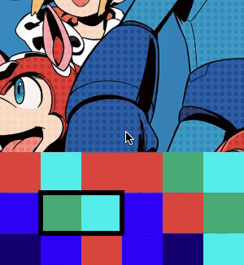
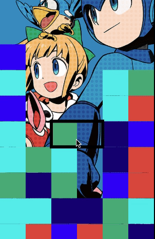

# Mega Man Puzzle League - [Live Game](https://jmarkowitz098.github.io/pdp-clone/dist/)


Mega Man Puzzle League is a tribute to Tetris Attack from the SNES with a Mega Man theme. The game is played by swapping blocks with the cursor and trying to get a match of 3 either horizontally or vertically. Try to surive as long as you can without the blocks touching the top!

## Technologies
1. JavaScript
2. Webpack
3. HTML
4. SCSS
5. Canvas.js

## Features
+ Exciting Gameplay
+ Use WASD and spacebar keys to move cursor and swap blocks
+ Score reflective of how long you survive!
+ Nostalgic Mega Man theme

## Challenges

**Getting blocks to swap places**



Swapping blocks proved a challenge because I had to track where they were and where they were going. I ended up tracking this both by the blocks coordinates as well as the blocks position in the array. This meant that swapping blocks meant swapping all of these things:

```javascript
swapBlock(otherBlock, grid) {
    let temp = new Block({
        canvPos: this.canvPos,
        gridPos: this.gridPos,
        color: this.color
    });

    let gridRow = this.gridPos[0]
    let gridCol = this.gridPos[1]
    let newRow = otherBlock.gridPos[0]
    let newCol = otherBlock.gridPos[1];

    [grid.blocks[gridRow][gridCol], grid.blocks[newRow][newCol]] =
    [grid.blocks[newRow][newCol], grid.blocks[gridRow][gridCol]]
    this.canvPos = otherBlock.canvPos;
    this.gridPos = otherBlock.gridPos;
    otherBlock.canvPos = temp.canvPos;
    otherBlock.gridPos = temp.gridPos;
}
```

**Gravity issues**



Another challenge was making sure blocks only disappeared once they were on the ground. I solved this by having my clear method check to make sure none of the blocks below the match were empty before clearing them.

```javascript
blocksOnGround(blocks) {
    let bool = true;
    
    blocks.forEach(block => {
        let blockUnder;
        if(block.gridPos[0] > 0){
            blockUnder = this.grid.blocks[block.gridPos[0] - 1][block.gridPos[1]]
        }
        if (blockUnder && blockUnder.isWhite()) {
            bool = false;
        }
    })
    return bool;
}
```

## Future Features
+ Animations for swapping blocks and clearing them
+ Stack pauses when getting matches
+ Score system with higher matches giving more points
+ Websockets for online versus play